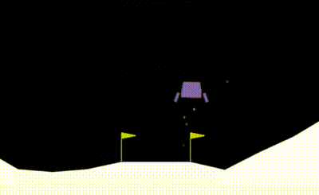

# 🚀 Deep Q-Learning for Lunar Lander 🛰️



## 🌟 Overview

Welcome to the **Deep Q-Learning for Lunar Lander** project! This project aims to train an intelligent agent to land a lunar module safely on a designated landing pad using Deep Q-Networks (DQN). The agent learns to control the lander's thrusters to achieve a smooth landing.

## 📓 Jupyter Notebook

This project is implemented in a Jupyter Notebook, making it easy to follow the code and see the results interactively.

## 📦 Installation

Follow these steps to set up the project on your local machine:

1. **Clone the Repository**:
   ```sh
   git clone https://github.com/harshaparida/LunarBot.git
   cd LunarBot
   ```

2. **Install Dependencies**:
   Install the required libraries using pip:

   ```sh
   pip install gymnasium
   pip install "gymnasium[atari, accept-rom-license]"
   pip install "gymnasium[box2d]"
   pip install torch numpy
   sudo apt-get install -y swig
   ```

3. **Launch Jupyter Notebook**:
   Start Jupyter Notebook to run the project:

   ```sh
   jupyter notebook
   ```

4. **Open the Notebook**:
   In Jupyter Notebook, open the `_dqn.ipynb` file to explore the project.

## 🚀 Usage

### Training the Agent

Run the cells in the Jupyter Notebook to train the agent.

### Watching the Trained Agent

After training, you can watch the trained agent in action by running the provided cells in the notebook.

## 🛠️ Libraries and Tools

- 
- 
- 
- 
- 

## 📁 Project Structure

- `lunar_lander_dqn.ipynb`: Jupyter Notebook containing the implementation.
- `README.md`: This file.
- `demo.gif`: Demo GIF showing the trained agent in action.

## 📈 Results

The agent successfully learned to land the lunar module, solving the LunarLander-v2 environment in approximately 733 episodes, achieving an average score of over 200.


## 💡 Contributing

Contributions are welcome! Feel free to fork this repository, make improvements, and submit a pull request. Let's collaborate to make this project even better!

## 📬 Contact

For any inquiries or feedback, please reach out to [my email](mailto:harshabardhanaparida@gmail.com).

---
